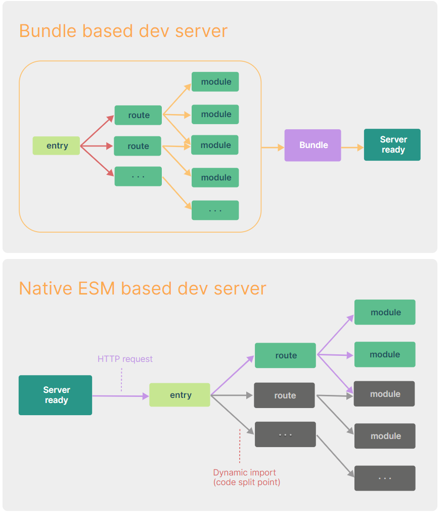
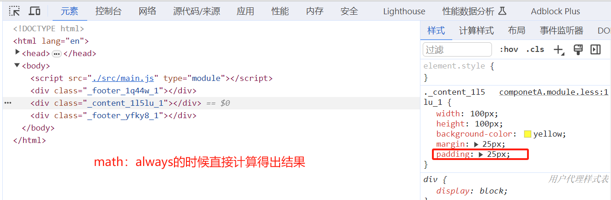
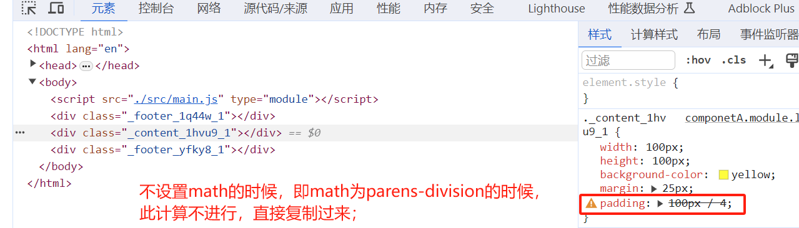
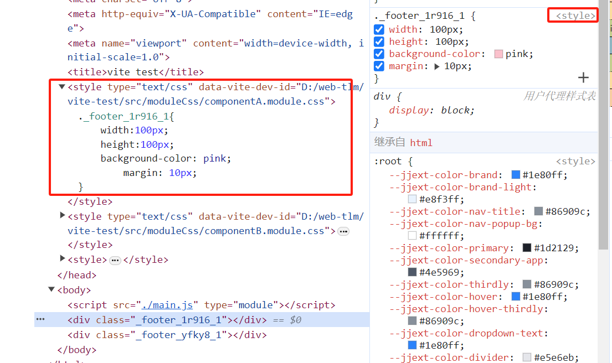
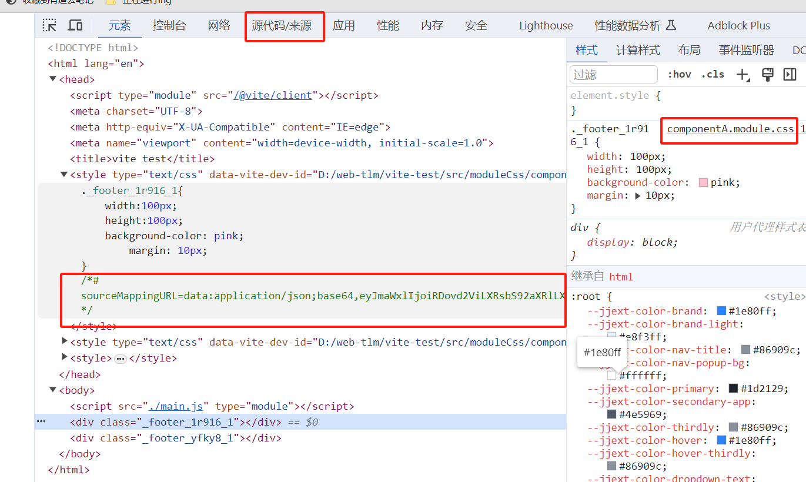
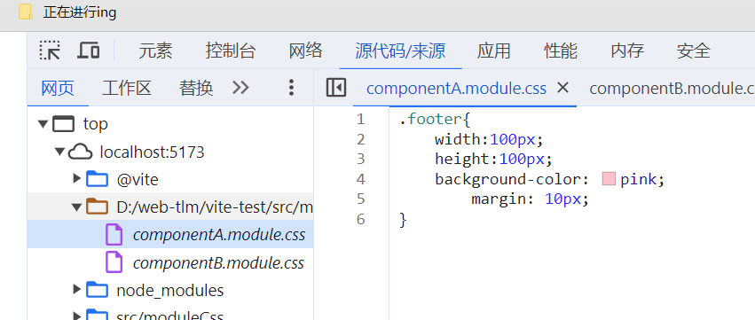

# vite

——视频地址：https://www.bilibili.com/video/BV1GN4y1M7P5/?vd_source=9e42e0462d6c2c47b88bd8f678e80ad7

[vite 官网](https://cn.vitejs.dev/guide/why.html)

## 1.webpack 的缺点

项目越大，构建工具（webpack)所要处理的 js 代码就越多（跟 webpack 的一个构建过程（工作流程）有关系）；构建工具需要很长时间才能启动开发服务器

webpack 是支持多种模块化的（commjs，es module)，他一开始必须要统一模块化代码，所以意味着他需要将所有的依赖全都读一遍

vite 是基于 es modules 的，他就不允许你写 commjs 代码，所以编译起来更快一点

vite 不会直接干翻 webpack，两侧重点不同：vite 关注浏览器端的开发体验，webpack 更多关注兼容性



## vite 的脚手架

`yarn create vite`其实相当于执行的是 1.安装 create-vite 脚手架，然后执行 create-vite 中 bin 目录的下的一个执行配置

create-vite 是脚手架，内置了 vite

## vite 的依赖预构建：

```js
import _ from 'lodash' // lodash可能又import了很多其他的东西
```

在处理过程中如果说看到了有非绝对路径或者相对路径的引用，他则会尝试开启路径补全；

```js
import _ from 'node_modules/.vite/loadsh'

// 真实引入成这样了
import __vite__cjsImport0_lodash from '/node_modules/.vite/deps/lodash.js?v=affecd03'
```

找寻依赖的过程是自当前目录依次向上查找的过程，直到搜寻到根目录活搜寻到对应依赖为止；

> 在生产环境 vite 会全权交给 rollup 库去打包；

开发环境依赖预构建：

首先 vite 会找到对应的依赖，然后调用 esbuild(go 语言写的一个对 js 语法进行处理的一个库)，将其他规范的代码转换成 esmodule 规范，然后放到当前目录下的 node_modules/.vite/deps,同时对 esmodule 规范的各个模块进行统一集成

```js
// a.js
export default function a() {}
```

```js
export {default as a} from './a.js'
```

vite 重写以后：

```js
function a() {}
```

他解决了 3 个问题：

1.不同的第三方包会有不同的到处格式

2.对路径的处理上可以直接使用.vite/deps，方便路径重写

3.叫做网络多包传输的性能问题（也是原生 esmodule 规范不敢支持 node_modules 的原因之一），有了依赖预构建以后无论他有多少的额外 export 和 import，vite 都会尽可能的将他们进行集成最后只生成一个或者几个模块

## vite 的配置文件

### 智能提示

这个我这里有效

```js
import {defineConfig} from 'vite'

export default defineConfig({
	// ...
})
```

下面的在我的 vite 起的 vue3 的项目里不起作用，但是在空项目里可行

```js
/** @type {import('vite').UserConfig} */
export default {
	// ...
}
```

## vite 的环境变量

vite 是使用 dotenv 这个第三方库来处理环境变量的；

dotenv 会自动读取.env 文件，并解析这个文件中的对应环境变量 并将其注入到 process 对象下(但是 vite 考虑到和其他配置的一些冲突问题，他不会直接注入到 process 对象下）。

涉及到 vite.config.js 中的一些配置:

- root
- envDir: 用来配置当前环境变量的文件地址

vite 给我们提供了一些补偿措施:我们可以调用 vite 的 loadEnv 来手动确认 env 文件;

process.cwd 方法: 返回当前 node 进程的工作目录;

- .env: 所有环境都需要用到的环境变量

- .env.development: 开发环境需要用到的环境变量(默认情况下 vite 将我们的开发环境取名为 development)

- .env.production: 生产环境需要用到的环境变量(默认情况下 vite 将我们的生产环境取名为 production)

yarn dev --mode development 会将 mode 设置为 development 传递进来

**当我们调用 loadenv 的时候，他会做如下几件事:**

1,直接找到.env 文件不解释 并解析其中的环境变量 并放进一个对象里 2,将传进来的 mode 这个变量的值进行拼接:`.env.development`，并根据我们提供的目录去取对应的配置文件并进行解析，并放进一个对象 3，我们可以理解为

```js
const baseEnvConfig = 读取.env的配置
const modeEnvConfig = 读取env相关配置
const lastEnvConfig = {...baseEnvConfig, ...modeEnvConfig}
```

如果是**客户端**，vite 会将对应的环境变量注入到 import.meta.env 里去;

vite 做了一个拦裁，他为了防止我们将隐私性的变量直接送进 mport.meta.env 中，所以他做了一层拦截，如果你的环境变量不是以 VITE 开头的，他就不会帮你注入到客户端中去，如果我们想要更改这个前缀，可以去使用 envPrefix 配置

**补充一个小知识**:为什么 vite.config.js 可以书写成 esmodule 的形式，这是因为 vite 他在读取这个 vite.configjs 的时候会率先 node 去解析文件语法，如果发现你是 esmodule 规范会直接将你的 esmodule 规范进行替换变成 commonjs 规范

## vite 中处理 css

1. vite 在读取到 main.js 中引用到了 Index.css
2. 直接去使用 fs 模块去读取 index.css 中文件内容
3. 直接创建一个 style 标签，将 index.css 中文件内容直接 copy 进 style 标签里
4. 将 style 标签插入到 index.html 的 head 中
5. 将该 CSs 文件中的内容直接换为 s 脚本(方便热更新或者 CSS 模块化)，同时设置 ontent-Type 为从而浏览器以 JS 脚本的形式来执行该 CSS 后缀的文件

### **css module :**

- 一个组件最外层的元素类名一般取名 :wrapper
- 一个组件最底层的元素雷明明我们一般取名: footer 你取了 footer 这个名字，别人因为没有看过你这个组件的源代码，也可能去取名 footer 这个类名最终可能会导致样式被覆盖(因为类名重复)，这就是我们在协同开发的时候很容易出现的问题

cssmodule 就是来解决这个问题的

**大概说一下原理:**

全部都是基于 node

- 1. module.css (module 是一种约定，表示需要开启 css 模块化)
- 2.他会将你的所有类名进行一定规则的替换(将 footer 换成 \_footer_i22st_1)
- 3.同时创建一个映射对象{ footer:“\_footer_i22st_1"》
- 4.将替换过后的内容塞进 style 标签里然后放入到 head 标签中 (能够读到 index,html 的文件内容)
- 5.将 componentA.module.css 内容进行全部抹除，替换成 JS 脚本
- 6.将创建的映射对象在脚本中进行默认导出

### vite 中 css module 的配置

```js
 css:{ // 对css的行为进行配置
        // modules配置最终会丢给postcss modules
        modules:{// 是对css模块化的默认行为进行覆盖
            localsConvention:"camelCaseOnly",// 修改生成的配置对象的key的展示形式(驼峰还是中划线形式),camelCase,camelCaseOnly.dash,dashOnly
            sopeBehaviour:"local",// 配置当前的模块化行为是模块化还是全局化(有hash就是开启了模块化的一个标志，因为他可以保证产生不同的hash值来控制我们的样式举名不被覆盖)
            // generateScopedName: "[name]_[locall_[hash:5]"  // 生成的类名的规则(可以配置为函数，也可以配置成字符串规则: https://github,com/webpack/loader-utils#interpolatename)
            generateScopedName: (name, filename, css) => {
                //name->代表的是你此刻css文件中的类名
                //filename->是你当前css文件的绝对路径
                //css-> 给的就是你当前样式
                console,log("name",name,"filename",filename,"css",css);
                // 配置成函数以后，返回值就决定了他最终显示的类型
                return `$(name)_$(Math.random().tostring(36).substr(3,8)}`;
            },
            // hashPrefix:生成hash会根据你的类名 + 一些其他的字符(文件名 + 他部随机生成一个字符审)去进行生成，如果你想要你生成hash更加的独特一点，你可以配置hashPrefix，你配置的这个字符审会参与到最终的hah生成，(hash:只要你的字符审有一个字不一样，那么生成的hash就完全不一样，但是只要你的字符串完全一样，生成的hash就会一样)
            hashPrefix:"hello",
            globalModulePaths:["./componentB,module,css"],// 代表你不想参与到ss模块化的路径
        }
    }
```

### css 中的 preprocessorOptions 配置和 devSourcemap 配置

```js
css:{
    modules:{},
    preprocessorOptions:{ // 主要是用来配置css预处理的一些全局参数
        less:{ // 整个得配置对象都会最终给到less得执行参数（全局参数）中去，这里可以写的配置可以在https://lesscss.cn/usage/#less-options这块查看
            math:'always', // less编译为css的时候，将比如不带括号的这种100px / 2的是否进行计算得50px，还是原来得写法100px / 2原封不动得复制过去
            globalVars:{ // 全局变量
                mainColor:"red"
            }
        },
        sass:{}
    },
    devSourcemap: true，// 开启css的sourceMap( 文件索引)
}
```





> 假设没有使用构建工具，我们又想去编译 less 文件的话
>
> ```r
> yarn add less # lessc的编译器
> ```
>
> 你只要安装了 node，你就可以使用 node index.is 你只要安装了 less 你就可以使用 Lessc 去编译 less 文件

---

devSourcemap 设为 true 的时候，你在 chrome 控制台查看样式时就可以直接点开其文件了。是因为 vite 在打包时在 css 中增加了一个 sourcemap；

**devSourcemap:false** 如下：



**devSourcemap:true**如下






## postcss

我们写的CSs代码(怎么怎么来)--> postcss --- [去将语法进行编译(语法，函，变量)成原生s5] less sass等预处理器都客户以做 -->再次对未来的高级cSs语法进行降级 -->前缀补全 --> 浏览器客户端

目前来说 ess和sas等一系列预处理器的postss播件已经停止维护了 less插件  你自己去用Lss和sass编译完了，然后你把编译结果给我**所以业内就产生了一个新的说法: postcss是后处理器**

我们写的代码(怎么爽怎么来) -- babel -- 将最新的t法进行转换5语法 -做一次语法降级 -浏览客户去执行


浏览器的兼容性你能考虑到吗，预处理器并不能够解决这些问题:

* 1.对未来css属性的一些使用降级问题
* 2.前缀补全: Google非常卷 --webkit

**使用postcss**:

* 1.安装

```bash
yarn add postcss-cli postcss -D
```

postcss-cli可以直接拿来输出用，比如在控制台直接：`npx postcss index.css -o result.css`

* 2.写配置文件

```js
// postcss.config.js
const postcssPresetEnv = require("postcss-preset-env") // postcss的预设，包括了一些基础的必要插件（需要安装postcss-preset-env）

module.exports = {
    plugins:[postcssPresetEnv(/*pluginOptions*/)]
}
```

```js
postcss:{// 可以在这里写，也可以在根目录下写一个postcss.config.js，vite也会去自动取读取，此处的优先级比postcss.config.js高
    plugins:[
        postcssPresetEnv({// 预设里包括了自动补全、降级等
            importFrom:path.resolve(__dirname,'./src/moduleCss/variable.css') // importFrom就好比你现在让postcss去知道 有一些全局变量他需要提前引入，
        })
    ], 
}

```


## vite 处理静态资源

## vite 的插件

> 随手记：
>
> - ts 文件需要 tsc 转换为 js
> - react 的 jsx 需要通过 react-complier 转换
> - vue 的.vue 需要通过 vue-complier 转换
